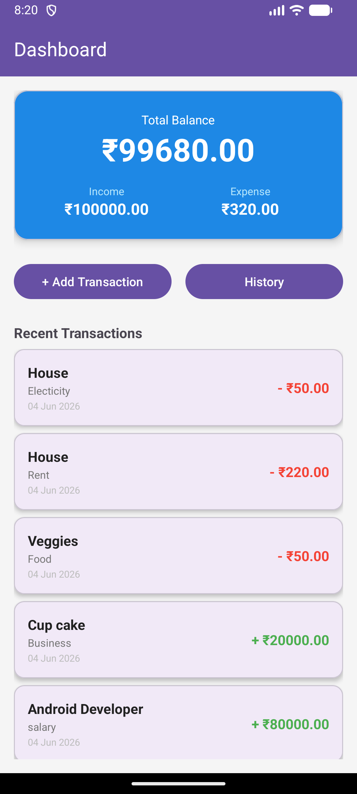
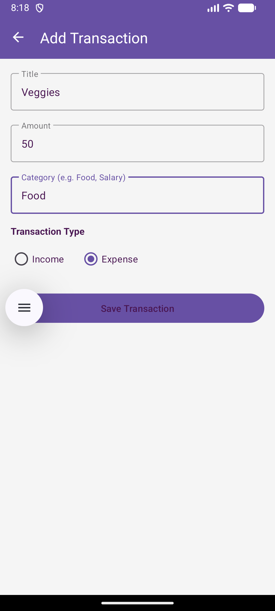
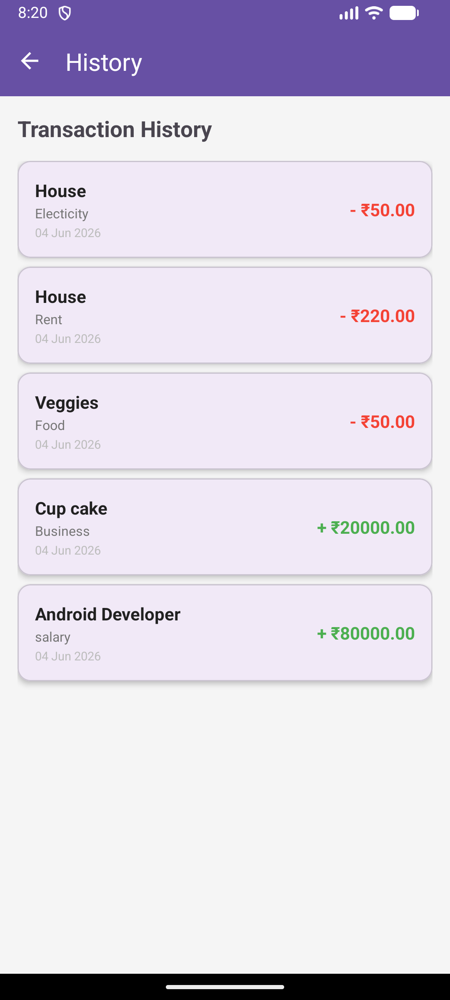

# 💰 FinTrack — Personal Finance Tracker

A clean Android app to track income and expenses built with Kotlin and MVVM architecture.

## Screenshots

| Dashboard | Add Transaction | History |
|-----------|----------------|---------|
|  |  |  |

## Features
- Add income and expense transactions
- Categorise transactions (Food, Transport, Salary, etc.)
- Dashboard showing total balance, income and expenses
- Full transaction history
- Long press any transaction to delete it

## Tech Stack
- **Language:** Kotlin
- **Architecture:** MVVM + Repository Pattern
- **Database:** Room (SQLite)
- **UI:** Material Design 3, XML Layouts
- **Navigation:** Jetpack Navigation Component
- **Async:** Kotlin Coroutines + LiveData

## Architecture
UI → ViewModel → Repository → Room Database
